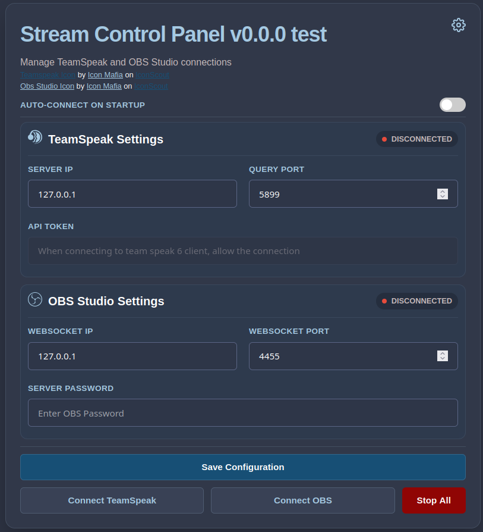
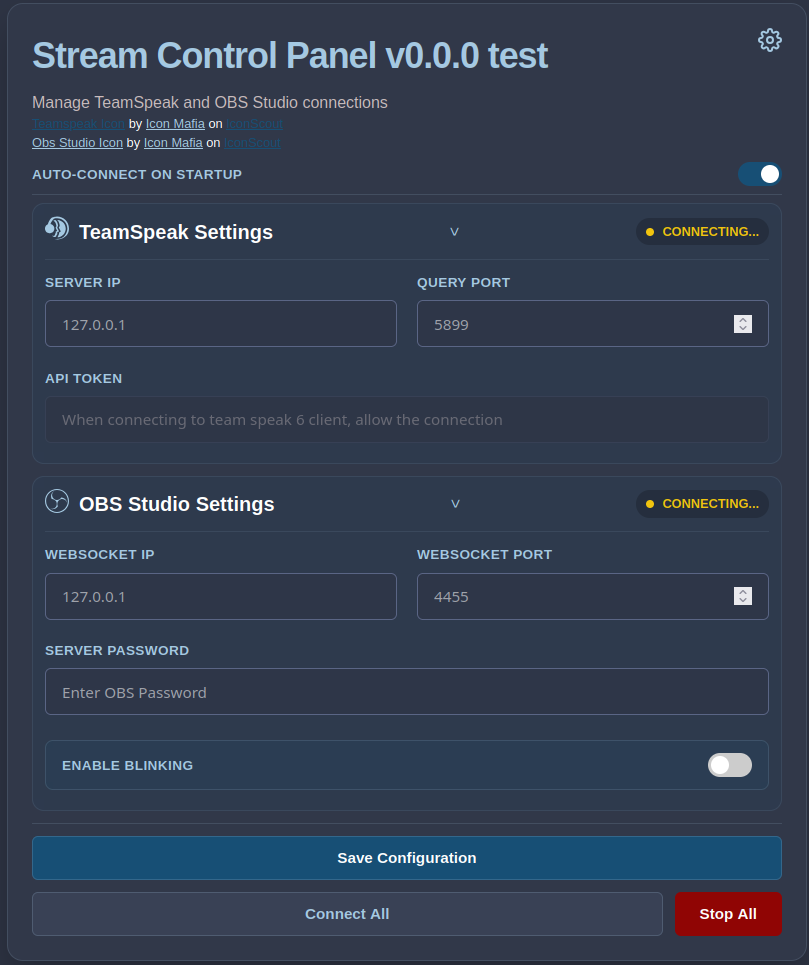
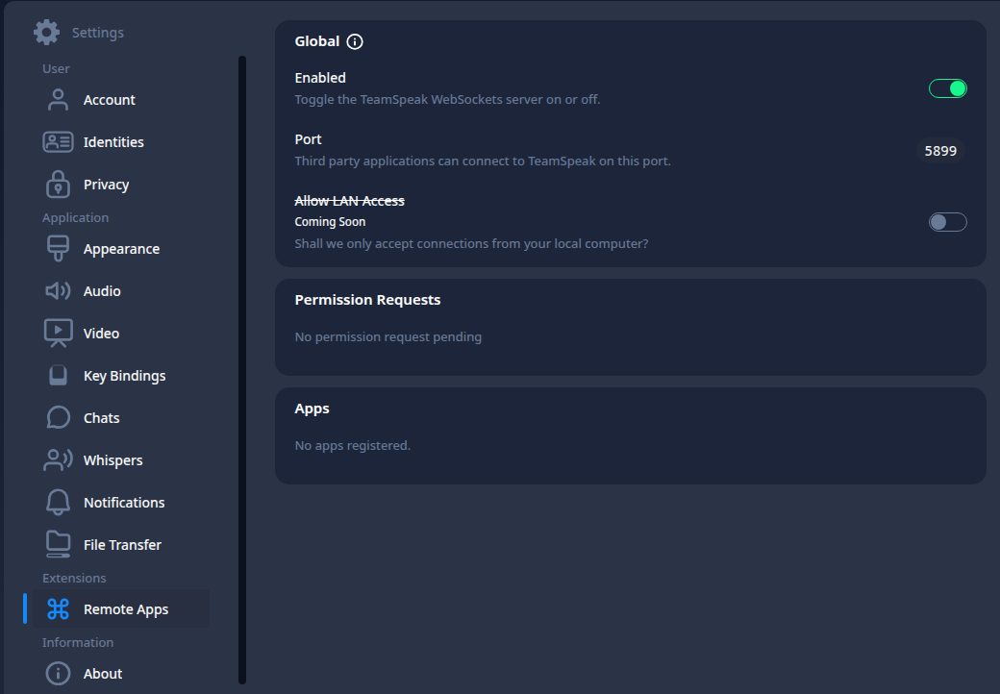
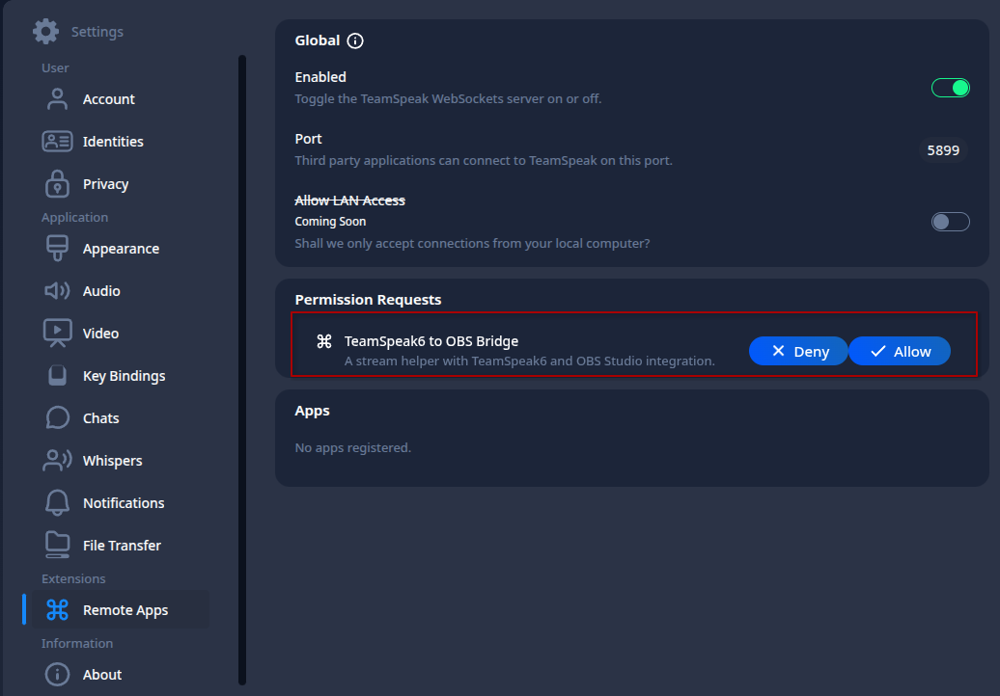
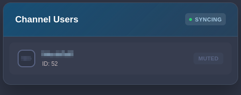
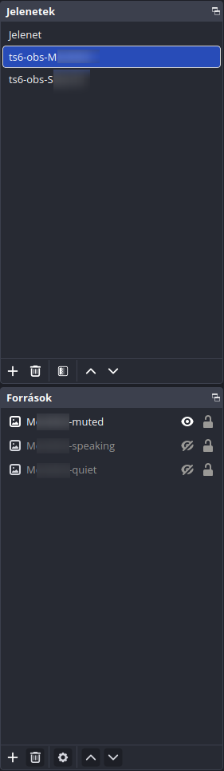
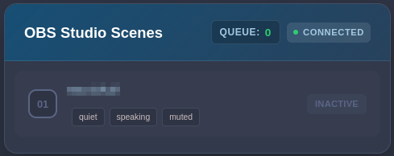

# Team Speak 6 - OBS Bridge
This is a Utility created for a streamer friend.
When a user that you have everything already set up for in OBS, joins or leaves the Team Speak channel, the icons will behave as expected.
When you mute a user, there is a way to have a `muted` state to them so you can visibly silence them.

When started, a web UI will be hosted on http://127.0.0.1:12345.
> [!IMPORTANT]
> The UI was created with Gemini, as I'm not a UI developer.

If the ports and IPs are correct, you just need to fill in the password and the scene name for OBS.

## Auto-connect
With the auto-connect toggle, you can enable the autoconnection to the setup OBS and Team Speak websocket.
When enabled, the two connect buttons will be swapped to a "connect all" button.

In this mode, the application will try to reconnect every 5 seconds when a connection is dropped.

## Team Speak
> [!CAUTION]
> For the use, you need to connect to the server you want to use for the stream on Team Speak before connecting the application to it.

For Team Speak, when you click on connect, the application will request an API key from Team Speak.

You will need to allow the application to create an API key for it, and save it to the application's database.

When connected you will be able to click on the "CONNECTED" marker to open a diagnostic page for the connection with basic information.

## OBS
In OBS you will need to create a scene for every user with the name `ts6-obs-[USERNAME]` Where `[USERNAME]` should be the exact username on Team Speak.
Under this scene you can set up the following sources:
 - [[ANYTHING]-muted](#muted)
 - [[ANYTHING]-speaking](#speaking)
 - [[ANYTHING]-quiet](#quiet)

Where `[ANYTHING]-` is filtered out so you can have multiple scenes set up for multiple users. For ease of use, `[USERNAME]` is recommended.

### muted
This image will be shown, when you mute the given user or deafen yourself.

### speaking
This image will be shown, when the user speaks.

### quiet
This image will be shown, when the user is quiet.

When connected you will be able to click on the "CONNECTED" marker to open a diagnostic page for the connection with basic information.

On this page, you will be able to see all scenes with the correct names, and all images under each scene.
The inactive marker will change, when the user connects to your room on Team Speak.
The `queue` shows how many requests are waiting to be red by the connector for diagnostics porpoises.
